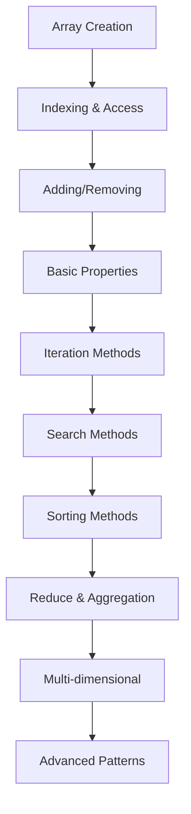

# Pembelajaran JavaScript Arrays Secara Bertahap

Selamat datang di materi pembelajaran JavaScript Arrays yang komprehensif! Materi ini dirancang untuk membantu Anda menguasai arrays dalam JavaScript dari dasar hingga tingkat lanjut dengan pendekatan bertahap dan studi kasus praktis.

## 📊 Apa itu JavaScript Arrays?

**JavaScript Arrays** adalah struktur data yang memungkinkan Anda untuk menyimpan multiple values dalam satu variable. Arrays adalah ordered collections yang dapat menyimpan berbagai tipe data dan menyediakan banyak built-in methods untuk manipulasi data yang powerful dan efficient.

## 📚 Struktur Pembelajaran

### 🎯 Level 1: Array Fundamentals (4 lessons)
1. **[array.1.md](./array.1.md)** - Pengenalan Arrays dan Array Creation
2. **[array.2.md](./array.2.md)** - Array Indexing dan Basic Operations
3. **[array.3.md](./array.3.md)** - Adding dan Removing Elements
4. **[array.4.md](./array.4.md)** - Array Length dan Basic Properties

### 🧩 Level 2: Array Methods (3 lessons)
5. **[array.5.md](./array.5.md)** - Iteration Methods (forEach, map, filter)
6. **[array.6.md](./array.6.md)** - Search dan Find Methods
7. **[array.7.md](./array.7.md)** - Sorting dan Ordering Methods

### 🚀 Level 3: Advanced Arrays (3 lessons)
8. **[array.8.md](./array.8.md)** - Reduce dan Aggregate Methods
9. **[array.9.md](./array.9.md)** - Multi-dimensional Arrays
10. **[array.10.md](./array.10.md)** - Advanced Array Patterns dan Performance

## 🎯 Tujuan Pembelajaran

Setelah menyelesaikan materi ini, Anda akan mampu:

### 📊 **Array Core Skills**
- ✅ Membuat dan memanipulasi arrays dengan berbagai methods
- ✅ Menggunakan iteration methods untuk data processing
- ✅ Menerapkan functional programming patterns dengan arrays
- ✅ Mengelola complex data structures dengan multi-dimensional arrays
- ✅ Mengoptimalkan performance array operations

### 🔄 **Functional Programming**
- ✅ Map, filter, reduce patterns untuk data transformation
- ✅ Chaining array methods untuk complex operations
- ✅ Immutable array operations
- ✅ Higher-order functions dengan arrays
- ✅ Declarative programming style

### 💼 **Real-world Applications**
- ✅ Data processing dan analysis
- ✅ DOM manipulation dengan arrays
- ✅ API response handling
- ✅ State management dalam applications
- ✅ Algorithm implementation

## 🚀 Mengapa Belajar JavaScript Arrays?

### JavaScript Arrays Advantages:
- **📊 Data Organization** - Efficient storage of ordered data
- **🔄 Rich Methods** - Extensive built-in methods untuk manipulation
- **⚡ Performance** - Optimized untuk common operations
- **🎯 Functional Programming** - Support untuk functional patterns
- **🌐 Ubiquitous** - Used everywhere dalam JavaScript development
- **🔧 Flexibility** - Dynamic sizing dan mixed data types

### Arrays vs Other Data Structures:

| Data Structure | Ordered | Indexed | Duplicates | Use Case |
|----------------|---------|---------|------------|----------|
| **Arrays** | Yes | Yes | Yes | Ordered collections |
| **Objects** | No | No | No | Key-value pairs |
| **Sets** | No | No | No | Unique values |
| **Maps** | Yes | No | No | Key-value with any keys |

## 📋 Prerequisites

### JavaScript Knowledge
- **JavaScript Basics** - Variables, functions, data types
- **Control Structures** - Loops, conditionals
- **Functions** - Function declarations, expressions, arrow functions
- **Objects** - Basic object manipulation
- **ES6+ Features** - Destructuring, spread operator

### Development Environment
- **Code Editor** - VS Code dengan JavaScript extensions
- **Web Browser** - Chrome/Firefox dengan DevTools
- **Node.js** - JavaScript runtime (optional)
- **Package Manager** - npm atau yarn (optional)

### Optional but Helpful
- **Functional Programming** - Basic FP concepts
- **Algorithms** - Sorting, searching algorithms
- **Data Structures** - Understanding of data organization
- **Testing** - Unit testing concepts
- **Performance** - Big O notation basics

## 🛠️ Development Environment Setup

### Basic Setup
```bash
# Create project directory
mkdir javascript-arrays-learning
cd javascript-arrays-learning

# Create basic files
touch index.js
touch index.html
touch arrays-examples.js

# Optional: Initialize npm project
npm init -y
```

### HTML Template
```html
<!DOCTYPE html>
<html lang="en">
<head>
    <meta charset="UTF-8">
    <meta name="viewport" content="width=device-width, initial-scale=1.0">
    <title>JavaScript Arrays Learning</title>
</head>
<body>
    <h1>JavaScript Arrays Examples</h1>
    
    <div id="output"></div>
    <button id="runExamples">Run Array Examples</button>
    
    <script src="arrays-examples.js"></script>
    <script src="index.js"></script>
</body>
</html>
```

### VS Code Configuration
```json
// .vscode/settings.json
{
  "javascript.preferences.quoteStyle": "single",
  "javascript.format.semicolons": "insert",
  "javascript.inlayHints.parameterNames.enabled": "all",
  "javascript.inlayHints.variableTypes.enabled": true,
  "editor.codeActionsOnSave": {
    "source.fixAll.eslint": true
  }
}
```

## 🎯 Learning Path



## 🏆 Milestone Projects

Sepanjang pembelajaran, Anda akan membangun:

1. **Todo List Manager** - Basic array operations dan CRUD
2. **Data Filter System** - Advanced filtering dan searching
3. **Shopping Cart** - Array manipulation untuk e-commerce
4. **Grade Calculator** - Statistical operations dengan arrays
5. **Image Gallery** - Multi-dimensional arrays untuk media
6. **Data Dashboard** - Complex data processing dan visualization
7. **Algorithm Visualizer** - Sorting dan searching algorithms

## 📊 JavaScript Arrays Core Concepts

### Array Creation dan Initialization
```javascript
// Array literal syntax (most common)
const fruits = ['apple', 'banana', 'orange'];
const numbers = [1, 2, 3, 4, 5];
const mixed = ['hello', 42, true, null, { name: 'John' }];

// Array constructor
const emptyArray = new Array();
const arrayWithLength = new Array(5); // Creates array with 5 empty slots
const arrayWithElements = new Array(1, 2, 3, 4, 5);

// Array.from() - create from iterable
const fromString = Array.from('hello'); // ['h', 'e', 'l', 'l', 'o']
const fromSet = Array.from(new Set([1, 2, 2, 3])); // [1, 2, 3]
const fromRange = Array.from({ length: 5 }, (_, i) => i + 1); // [1, 2, 3, 4, 5]

// Array.of() - create from arguments
const ofNumbers = Array.of(1, 2, 3); // [1, 2, 3]
const ofSingle = Array.of(5); // [5] (not empty array with length 5)

// Spread operator for copying
const originalArray = [1, 2, 3];
const copiedArray = [...originalArray];
const extendedArray = [...originalArray, 4, 5, 6];

// Fill method
const filledArray = new Array(5).fill(0); // [0, 0, 0, 0, 0]
const filledWithObjects = new Array(3).fill(null).map(() => ({ id: Math.random() }));

console.log('Fruits:', fruits);
console.log('From range:', fromRange);
console.log('Filled array:', filledArray);
```

### Array Access dan Modification
```javascript
const colors = ['red', 'green', 'blue', 'yellow'];

// Basic indexing
console.log(colors[0]); // 'red'
console.log(colors[colors.length - 1]); // 'yellow'
console.log(colors[-1]); // undefined (no negative indexing)

// Using at() method (ES2022)
console.log(colors.at(0)); // 'red'
console.log(colors.at(-1)); // 'yellow' (negative indexing works)

// Modifying elements
colors[1] = 'lime';
console.log(colors); // ['red', 'lime', 'blue', 'yellow']

// Adding elements
colors.push('purple'); // Add to end
colors.unshift('black'); // Add to beginning
colors.splice(2, 0, 'pink'); // Insert at index 2

// Removing elements
const lastColor = colors.pop(); // Remove from end
const firstColor = colors.shift(); // Remove from beginning
const removedColors = colors.splice(1, 2); // Remove 2 elements starting at index 1

// Destructuring assignment
const [first, second, ...rest] = colors;
console.log('First:', first, 'Second:', second, 'Rest:', rest);

// Swapping elements
let a = colors[0];
let b = colors[1];
[colors[0], colors[1]] = [b, a]; // Swap using destructuring

console.log('Modified colors:', colors);
```

### Array Iteration Methods
```javascript
const numbers = [1, 2, 3, 4, 5, 6, 7, 8, 9, 10];

// forEach - execute function for each element
numbers.forEach((num, index) => {
    console.log(`Index ${index}: ${num}`);
});

// map - transform each element
const doubled = numbers.map(num => num * 2);
const squared = numbers.map(num => num ** 2);
const withIndex = numbers.map((num, index) => ({ value: num, index }));

console.log('Doubled:', doubled);
console.log('Squared:', squared);

// filter - select elements based on condition
const evenNumbers = numbers.filter(num => num % 2 === 0);
const greaterThanFive = numbers.filter(num => num > 5);
const complexFilter = numbers.filter((num, index) => num > 3 && index < 7);

console.log('Even numbers:', evenNumbers);
console.log('Greater than 5:', greaterThanFive);

// find - get first element that matches condition
const firstEven = numbers.find(num => num % 2 === 0);
const firstGreaterThanFive = numbers.find(num => num > 5);

// findIndex - get index of first matching element
const firstEvenIndex = numbers.findIndex(num => num % 2 === 0);

// some - check if at least one element matches
const hasEvenNumbers = numbers.some(num => num % 2 === 0);
const hasNegativeNumbers = numbers.some(num => num < 0);

// every - check if all elements match
const allPositive = numbers.every(num => num > 0);
const allEven = numbers.every(num => num % 2 === 0);

console.log('First even:', firstEven);
console.log('Has even numbers:', hasEvenNumbers);
console.log('All positive:', allPositive);

// Method chaining
const result = numbers
    .filter(num => num > 3)
    .map(num => num * 2)
    .filter(num => num < 20);

console.log('Chained result:', result);
```

### Advanced Array Methods
```javascript
const data = [
    { name: 'John', age: 30, salary: 50000, department: 'IT' },
    { name: 'Jane', age: 25, salary: 45000, department: 'HR' },
    { name: 'Bob', age: 35, salary: 60000, department: 'IT' },
    { name: 'Alice', age: 28, salary: 55000, department: 'Finance' },
    { name: 'Charlie', age: 32, salary: 48000, department: 'HR' }
];

// reduce - aggregate data
const totalSalary = data.reduce((sum, person) => sum + person.salary, 0);
const averageAge = data.reduce((sum, person) => sum + person.age, 0) / data.length;

// Group by department using reduce
const byDepartment = data.reduce((groups, person) => {
    const dept = person.department;
    if (!groups[dept]) {
        groups[dept] = [];
    }
    groups[dept].push(person);
    return groups;
}, {});

// Find min/max salary
const maxSalary = data.reduce((max, person) => 
    person.salary > max.salary ? person : max
);

const minSalary = data.reduce((min, person) => 
    person.salary < min.salary ? person : min
);

console.log('Total salary:', totalSalary);
console.log('Average age:', averageAge);
console.log('By department:', byDepartment);
console.log('Highest paid:', maxSalary);

// sort - arrange elements
const sortedByAge = [...data].sort((a, b) => a.age - b.age);
const sortedByName = [...data].sort((a, b) => a.name.localeCompare(b.name));
const sortedBySalaryDesc = [...data].sort((a, b) => b.salary - a.salary);

// Multiple sorting criteria
const sortedMultiple = [...data].sort((a, b) => {
    if (a.department !== b.department) {
        return a.department.localeCompare(b.department);
    }
    return b.salary - a.salary; // Within same department, sort by salary desc
});

console.log('Sorted by age:', sortedByAge);
console.log('Sorted multiple criteria:', sortedMultiple);

// includes - check if array contains element
const names = data.map(person => person.name);
console.log('Has John:', names.includes('John'));
console.log('Has David:', names.includes('David'));

// indexOf / lastIndexOf - find element position
const johnIndex = names.indexOf('John');
const lastJohnIndex = names.lastIndexOf('John');

// join - convert array to string
const namesList = names.join(', ');
const htmlList = names.map(name => `<li>${name}</li>`).join('');

console.log('Names list:', namesList);

// reverse - reverse array order (mutates original)
const reversedNames = [...names].reverse();
console.log('Reversed names:', reversedNames);
```

### Multi-dimensional Arrays
```javascript
// 2D Array (Matrix)
const matrix = [
    [1, 2, 3],
    [4, 5, 6],
    [7, 8, 9]
];

// Accessing 2D array elements
console.log(matrix[0][0]); // 1
console.log(matrix[1][2]); // 6
console.log(matrix[2][1]); // 8

// Iterating through 2D array
matrix.forEach((row, rowIndex) => {
    row.forEach((cell, colIndex) => {
        console.log(`[${rowIndex}][${colIndex}] = ${cell}`);
    });
});

// Creating dynamic 2D array
function create2DArray(rows, cols, fillValue = 0) {
    return Array.from({ length: rows }, () => 
        Array.from({ length: cols }, () => fillValue)
    );
}

const gameBoard = create2DArray(3, 3, null);
console.log('Game board:', gameBoard);

// Matrix operations
function transposeMatrix(matrix) {
    return matrix[0].map((_, colIndex) => 
        matrix.map(row => row[colIndex])
    );
}

function addMatrices(matrix1, matrix2) {
    return matrix1.map((row, i) => 
        row.map((cell, j) => cell + matrix2[i][j])
    );
}

const transposed = transposeMatrix(matrix);
console.log('Transposed matrix:', transposed);

// 3D Array example
const cube = [
    [
        [1, 2],
        [3, 4]
    ],
    [
        [5, 6],
        [7, 8]
    ]
];

console.log('3D array element:', cube[1][0][1]); // 6

// Flattening multi-dimensional arrays
const nested = [[1, 2], [3, [4, 5]], [6, [7, [8, 9]]]];

// Shallow flatten
const shallowFlat = nested.flat(); // [1, 2, 3, [4, 5], 6, [7, [8, 9]]]

// Deep flatten
const deepFlat = nested.flat(Infinity); // [1, 2, 3, 4, 5, 6, 7, 8, 9]

// Custom flatten function
function flattenArray(arr) {
    return arr.reduce((flat, item) => {
        return flat.concat(Array.isArray(item) ? flattenArray(item) : item);
    }, []);
}

console.log('Custom flattened:', flattenArray(nested));
```

## 🎨 Advanced Array Patterns

### Functional Programming Patterns
```javascript
// Compose functions for data transformation
const compose = (...fns) => (value) => fns.reduceRight((acc, fn) => fn(acc), value);

const addTax = (price) => price * 1.1;
const addShipping = (price) => price + 10;
const formatCurrency = (price) => `$${price.toFixed(2)}`;

const calculateFinalPrice = compose(formatCurrency, addShipping, addTax);

const prices = [100, 200, 300];
const finalPrices = prices.map(calculateFinalPrice);
console.log('Final prices:', finalPrices);

// Pipe function (left-to-right composition)
const pipe = (...fns) => (value) => fns.reduce((acc, fn) => fn(acc), value);

const processData = pipe(
    (data) => data.filter(item => item.active),
    (data) => data.map(item => ({ ...item, processed: true })),
    (data) => data.sort((a, b) => a.priority - b.priority)
);

// Currying with arrays
const filterBy = (predicate) => (array) => array.filter(predicate);
const mapWith = (transformer) => (array) => array.map(transformer);

const filterActive = filterBy(item => item.active);
const mapToNames = mapWith(item => item.name);

const users = [
    { name: 'John', active: true },
    { name: 'Jane', active: false },
    { name: 'Bob', active: true }
];

const activeUserNames = pipe(filterActive, mapToNames)(users);
console.log('Active user names:', activeUserNames);

// Memoization for expensive array operations
function memoize(fn) {
    const cache = new Map();
    return function(...args) {
        const key = JSON.stringify(args);
        if (cache.has(key)) {
            return cache.get(key);
        }
        const result = fn.apply(this, args);
        cache.set(key, result);
        return result;
    };
}

const expensiveSort = memoize((array, compareFn) => {
    console.log('Performing expensive sort...');
    return [...array].sort(compareFn);
});

// Immutable array operations
class ImmutableArray {
    constructor(items = []) {
        this.items = Object.freeze([...items]);
    }
    
    push(item) {
        return new ImmutableArray([...this.items, item]);
    }
    
    pop() {
        return new ImmutableArray(this.items.slice(0, -1));
    }
    
    map(fn) {
        return new ImmutableArray(this.items.map(fn));
    }
    
    filter(fn) {
        return new ImmutableArray(this.items.filter(fn));
    }
    
    toArray() {
        return [...this.items];
    }
}

const immutableList = new ImmutableArray([1, 2, 3]);
const newList = immutableList.push(4).map(x => x * 2);
console.log('Original:', immutableList.toArray());
console.log('New:', newList.toArray());
```

### Performance Optimization
```javascript
// Efficient array operations
class OptimizedArray {
    constructor(initialCapacity = 10) {
        this.data = new Array(initialCapacity);
        this.length = 0;
        this.capacity = initialCapacity;
    }
    
    push(item) {
        if (this.length >= this.capacity) {
            this.resize();
        }
        this.data[this.length] = item;
        this.length++;
    }
    
    resize() {
        this.capacity *= 2;
        const newData = new Array(this.capacity);
        for (let i = 0; i < this.length; i++) {
            newData[i] = this.data[i];
        }
        this.data = newData;
    }
    
    get(index) {
        if (index < 0 || index >= this.length) {
            throw new Error('Index out of bounds');
        }
        return this.data[index];
    }
    
    toArray() {
        return this.data.slice(0, this.length);
    }
}

// Chunking large arrays for processing
function processInChunks(array, chunkSize, processor) {
    const results = [];
    for (let i = 0; i < array.length; i += chunkSize) {
        const chunk = array.slice(i, i + chunkSize);
        results.push(processor(chunk));
    }
    return results.flat();
}

// Lazy evaluation for large datasets
function* lazyMap(array, transformer) {
    for (const item of array) {
        yield transformer(item);
    }
}

function* lazyFilter(array, predicate) {
    for (const item of array) {
        if (predicate(item)) {
            yield item;
        }
    }
}

// Usage
const largeArray = Array.from({ length: 1000000 }, (_, i) => i);
const lazyResult = lazyFilter(
    lazyMap(largeArray, x => x * 2),
    x => x % 3 === 0
);

// Only compute when needed
const first10 = Array.from(lazyResult).slice(0, 10);
console.log('First 10 lazy results:', first10);

// Binary search for sorted arrays
function binarySearch(sortedArray, target) {
    let left = 0;
    let right = sortedArray.length - 1;
    
    while (left <= right) {
        const mid = Math.floor((left + right) / 2);
        const midValue = sortedArray[mid];
        
        if (midValue === target) {
            return mid;
        } else if (midValue < target) {
            left = mid + 1;
        } else {
            right = mid - 1;
        }
    }
    
    return -1; // Not found
}

// Quick sort implementation
function quickSort(array) {
    if (array.length <= 1) {
        return array;
    }
    
    const pivot = array[Math.floor(array.length / 2)];
    const less = array.filter(x => x < pivot);
    const equal = array.filter(x => x === pivot);
    const greater = array.filter(x => x > pivot);
    
    return [...quickSort(less), ...equal, ...quickSort(greater)];
}
```

## 🎓 Career Paths dalam JavaScript Arrays

### Technical Roles
- **JavaScript Developer** - Array manipulation dalam web applications
- **Frontend Developer** - DOM manipulation dengan arrays
- **Data Analyst** - Data processing dengan JavaScript arrays
- **Algorithm Developer** - Implementing algorithms dengan arrays
- **Full-Stack Developer** - Client-server data handling

### Specialized Roles
- **Performance Engineer** - Array optimization specialist
- **Data Visualization Developer** - Chart dan graph data processing
- **Game Developer** - Game state management dengan arrays
- **API Developer** - Data transformation dan serialization
- **Library Developer** - Array utility libraries

### Industry Applications
- **E-commerce** - Product catalogs, shopping carts, inventory
- **Data Analytics** - Data processing, filtering, aggregation
- **Gaming** - Game boards, player lists, high scores
- **Financial Software** - Transaction lists, portfolio management
- **Social Media** - User feeds, friend lists, notifications
- **Educational Software** - Student lists, grade calculations

## 🌟 Success Metrics

### Technical Skills
- [ ] **Array Creation** - Multiple creation patterns dan initialization
- [ ] **Iteration Mastery** - All iteration methods dan patterns
- [ ] **Functional Programming** - Map, filter, reduce proficiency
- [ ] **Performance** - Efficient array operations
- [ ] **Multi-dimensional** - Complex data structure handling
- [ ] **Algorithm Implementation** - Sorting, searching algorithms

### Project Milestones
- [ ] Build data processing pipeline dengan arrays
- [ ] Implement sorting dan searching algorithms
- [ ] Create functional programming utilities
- [ ] Build multi-dimensional data visualization
- [ ] Optimize array performance untuk large datasets
- [ ] Implement immutable array operations

## 🤝 Community dan Resources

### Learning Resources
- [MDN JavaScript Arrays](https://developer.mozilla.org/en-US/docs/Web/JavaScript/Reference/Global_Objects/Array)
- [JavaScript.info Arrays](https://javascript.info/array)
- [Array Methods Cheatsheet](https://github.com/rauschma/array-methods)
- [Functional Programming Guide](https://github.com/MostlyAdequate/mostly-adequate-guide)

### Communities
- [Stack Overflow JavaScript](https://stackoverflow.com/questions/tagged/javascript)
- [Reddit r/javascript](https://www.reddit.com/r/javascript/)
- [JavaScript Discord](https://discord.gg/javascript)
- [Dev.to JavaScript](https://dev.to/t/javascript)

### Tools dan Services
- **Development**: Chrome DevTools, Node.js
- **Testing**: Jest, Mocha, Jasmine
- **Performance**: Benchmark.js, Performance API
- **Visualization**: D3.js, Chart.js
- **Linting**: ESLint, JSHint

## 💡 Best Practices

### Array Performance
- **Use appropriate methods** - Choose right method untuk task
- **Avoid mutations** - Prefer immutable operations when possible
- **Chain efficiently** - Minimize intermediate arrays
- **Consider memory** - Be aware of memory usage dengan large arrays
- **Use typed arrays** - For numeric data dan performance

### Code Organization
1. **Pure Functions** - Avoid side effects dalam array operations
2. **Descriptive Names** - Use clear variable dan function names
3. **Single Responsibility** - Each function should do one thing
4. **Error Handling** - Handle edge cases dan invalid inputs
5. **Documentation** - Document complex array operations

### Functional Programming
1. **Immutability** - Prefer immutable operations
2. **Composition** - Combine simple functions untuk complex operations
3. **Declarative Style** - Focus on what, not how
4. **Method Chaining** - Use fluent interfaces
5. **Higher-Order Functions** - Leverage functions that take functions

## 📈 Salary Expectations

### Entry Level (0-2 years)
- **Junior JavaScript Developer** - $45k-65k
- **Frontend Developer** - $50k-70k
- **Web Developer** - $40k-60k

### Mid Level (2-5 years)
- **JavaScript Developer** - $65k-90k
- **Senior Frontend Developer** - $75k-105k
- **Data Developer** - $70k-95k

### Senior Level (5+ years)
- **Senior JavaScript Engineer** - $95k-125k
- **JavaScript Architect** - $105k-135k
- **Technical Lead** - $100k-130k

### Specialized Roles
- **Performance Engineer** - $110k-150k
- **Algorithm Developer** - $100k-140k
- **JavaScript Consultant** - $75-150/hour

---

**Selamat belajar! 📊**

*"Arrays are the workhorses of JavaScript. Master them, and you'll have the foundation to process, transform, and manipulate data in countless ways."*

**Ready to master JavaScript arrays? Let's start coding! 🚀**
