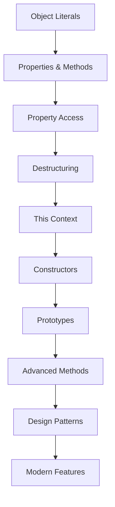

# Pembelajaran JavaScript Objects Secara Bertahap

Selamat datang di materi pembelajaran JavaScript Objects yang komprehensif! Materi ini dirancang untuk membantu Anda menguasai konsep objects dalam JavaScript dari dasar hingga tingkat lanjut dengan pendekatan bertahap dan studi kasus praktis.

## 🏗️ Apa itu JavaScript Objects?

**JavaScript Objects** adalah struktur data fundamental yang memungkinkan Anda untuk menyimpan collections of key-value pairs. Objects adalah building blocks dari hampir semua aplikasi JavaScript modern, memungkinkan Anda untuk mengorganisir data dan functionality dalam cara yang logical dan reusable.

## 📚 Struktur Pembelajaran

### 🎯 Level 1: Object Fundamentals (4 lessons)
1. **[object.1.md](./object.1.md)** - Pengenalan Objects dan Object Literals
2. **[object.2.md](./object.2.md)** - Object Properties dan Methods
3. **[object.3.md](./object.3.md)** - Accessing dan Modifying Object Properties
4. **[object.4.md](./object.4.md)** - Object Destructuring dan Spread Operator

### 🧩 Level 2: Object Intermediate (3 lessons)
5. **[object.5.md](./object.5.md)** - Object Methods dan This Context
6. **[object.6.md](./object.6.md)** - Object Constructors dan Prototypes
7. **[object.7.md](./object.7.md)** - Object Inheritance dan Prototype Chain

### 🚀 Level 3: Object Advanced (3 lessons)
8. **[object.8.md](./object.8.md)** - Advanced Object Methods dan Utilities
9. **[object.9.md](./object.9.md)** - Object Patterns dan Best Practices
10. **[object.10.md](./object.10.md)** - Modern Object Features dan ES6+

## 🎯 Tujuan Pembelajaran

Setelah menyelesaikan materi ini, Anda akan mampu:

### 🏗️ **Object Core Skills**
- ✅ Membuat dan memanipulasi JavaScript objects
- ✅ Menggunakan object properties dan methods effectively
- ✅ Memahami this context dan binding
- ✅ Mengimplementasikan object inheritance
- ✅ Menggunakan modern object features (ES6+)

### 🎨 **Object Design Patterns**
- ✅ Object-oriented programming patterns
- ✅ Factory functions dan constructor patterns
- ✅ Module patterns dan encapsulation
- ✅ Composition over inheritance
- ✅ Functional programming dengan objects

### 💼 **Professional Object Usage**
- ✅ Data modeling dan structure design
- ✅ API response handling
- ✅ State management patterns
- ✅ Performance optimization
- ✅ Testing object-oriented code

## 🚀 Mengapa Belajar JavaScript Objects?

### JavaScript Objects Advantages:
- **🏗️ Data Organization** - Logical grouping of related data
- **🔄 Reusability** - Reusable data structures dan methods
- **🎯 Encapsulation** - Bundle data dengan related functionality
- **📈 Scalability** - Foundation untuk complex applications
- **🌐 Web Development** - Essential untuk modern web development
- **🔧 Flexibility** - Dynamic property addition dan modification

### Objects vs Other Data Types:

| Data Type | Use Case | Complexity | Flexibility |
|-----------|----------|------------|-------------|
| **Objects** | Complex data structures | High | Very High |
| **Arrays** | Ordered collections | Medium | High |
| **Primitives** | Simple values | Low | Low |
| **Maps** | Key-value pairs | Medium | High |
| **Sets** | Unique values | Low | Medium |

## 📋 Prerequisites

### JavaScript Knowledge
- **JavaScript Basics** - Variables, functions, data types
- **ES6+ Features** - Arrow functions, destructuring, spread operator
- **Arrays** - Array methods dan manipulation
- **Functions** - Function declarations, expressions, scope
- **Control Structures** - Loops, conditionals

### Development Environment
- **Code Editor** - VS Code dengan JavaScript extensions
- **Web Browser** - Chrome/Firefox dengan DevTools
- **Node.js** - JavaScript runtime (optional)
- **Package Manager** - npm atau yarn (optional)

### Optional but Helpful
- **JSON** - JavaScript Object Notation
- **DOM Manipulation** - Working dengan HTML elements
- **Event Handling** - Event listeners dan callbacks
- **Testing** - Basic testing concepts
- **Design Patterns** - Common programming patterns

## 🛠️ Development Environment Setup

### Basic Setup
```bash
# Create project directory
mkdir javascript-objects-learning
cd javascript-objects-learning

# Create basic files
touch index.js
touch index.html
touch objects-examples.js

# Optional: Initialize npm project
npm init -y
```

### HTML Template
```html
<!DOCTYPE html>
<html lang="en">
<head>
    <meta charset="UTF-8">
    <meta name="viewport" content="width=device-width, initial-scale=1.0">
    <title>JavaScript Objects Learning</title>
</head>
<body>
    <h1>JavaScript Objects Examples</h1>
    
    <div id="output"></div>
    <button id="runExamples">Run Object Examples</button>
    
    <script src="objects-examples.js"></script>
    <script src="index.js"></script>
</body>
</html>
```

### VS Code Configuration
```json
// .vscode/settings.json
{
  "javascript.preferences.quoteStyle": "single",
  "javascript.format.semicolons": "insert",
  "javascript.inlayHints.parameterNames.enabled": "all",
  "javascript.inlayHints.variableTypes.enabled": true,
  "editor.codeActionsOnSave": {
    "source.fixAll.eslint": true
  }
}
```

## 🎯 Learning Path



## 🏆 Milestone Projects

Sepanjang pembelajaran, Anda akan membangun:

1. **Personal Profile Object** - Basic object creation dan manipulation
2. **Shopping Cart System** - Object methods dan state management
3. **User Management System** - Constructor functions dan prototypes
4. **Game Character System** - Inheritance dan polymorphism
5. **Data Processing Pipeline** - Advanced object methods
6. **Component Library** - Modern object patterns
7. **State Management System** - Complex object relationships

## 📊 JavaScript Objects Core Concepts

### Object Creation dan Literals
```javascript
// Object literal syntax
const person = {
    name: 'John Doe',
    age: 30,
    email: 'john@example.com',
    isActive: true,
    
    // Method definition
    introduce: function() {
        return `Hi, I'm ${this.name} and I'm ${this.age} years old.`;
    },
    
    // ES6 method shorthand
    greet() {
        return `Hello from ${this.name}!`;
    },
    
    // Arrow function (be careful with 'this')
    getEmail: () => {
        // 'this' doesn't refer to the object in arrow functions
        return 'Email not accessible';
    }
};

// Object creation with Object constructor
const user = new Object();
user.name = 'Jane Smith';
user.age = 25;
user.getInfo = function() {
    return `${this.name}, ${this.age}`;
};

// Object.create() method
const personPrototype = {
    introduce() {
        return `I'm ${this.name}`;
    }
};

const newPerson = Object.create(personPrototype);
newPerson.name = 'Alice';
newPerson.age = 28;

// Factory function pattern
function createUser(name, email, role = 'user') {
    return {
        name,
        email,
        role,
        isAdmin: role === 'admin',
        
        getDisplayName() {
            return `${this.name} (${this.role})`;
        },
        
        hasPermission(permission) {
            if (this.isAdmin) return true;
            // Add permission logic here
            return false;
        }
    };
}

const admin = createUser('Admin User', 'admin@example.com', 'admin');
const regularUser = createUser('Regular User', 'user@example.com');
```

### Property Access dan Manipulation
```javascript
const product = {
    id: 1,
    name: 'Laptop',
    price: 999.99,
    category: 'Electronics',
    specifications: {
        cpu: 'Intel i7',
        ram: '16GB',
        storage: '512GB SSD'
    },
    tags: ['computer', 'portable', 'work']
};

// Dot notation
console.log(product.name); // 'Laptop'
console.log(product.specifications.cpu); // 'Intel i7'

// Bracket notation
console.log(product['price']); // 999.99
console.log(product['specifications']['ram']); // '16GB'

// Dynamic property access
const propertyName = 'category';
console.log(product[propertyName]); // 'Electronics'

// Adding properties
product.inStock = true;
product['lastUpdated'] = new Date();

// Modifying properties
product.price = 899.99;
product.specifications.ram = '32GB';

// Deleting properties
delete product.tags;
delete product['lastUpdated'];

// Property existence checking
console.log('name' in product); // true
console.log(product.hasOwnProperty('price')); // true
console.log(product.description !== undefined); // false

// Object.keys(), Object.values(), Object.entries()
const keys = Object.keys(product);
const values = Object.values(product);
const entries = Object.entries(product);

console.log('Keys:', keys);
console.log('Values:', values);
console.log('Entries:', entries);

// Iterating over object properties
for (const key in product) {
    if (product.hasOwnProperty(key)) {
        console.log(`${key}: ${product[key]}`);
    }
}

// Modern iteration methods
Object.entries(product).forEach(([key, value]) => {
    console.log(`${key}: ${value}`);
});
```

### Destructuring dan Spread Operator
```javascript
const user = {
    id: 1,
    name: 'John Doe',
    email: 'john@example.com',
    address: {
        street: '123 Main St',
        city: 'New York',
        zipCode: '10001'
    },
    preferences: {
        theme: 'dark',
        notifications: true
    }
};

// Basic destructuring
const { name, email } = user;
console.log(name, email); // 'John Doe', 'john@example.com'

// Destructuring with renaming
const { name: userName, email: userEmail } = user;
console.log(userName, userEmail);

// Destructuring with default values
const { age = 25, country = 'USA' } = user;
console.log(age, country); // 25, 'USA'

// Nested destructuring
const { address: { city, zipCode } } = user;
console.log(city, zipCode); // 'New York', '10001'

// Rest operator in destructuring
const { name: fullName, ...otherDetails } = user;
console.log(fullName); // 'John Doe'
console.log(otherDetails); // Object without 'name' property

// Destructuring in function parameters
function displayUser({ name, email, address: { city } }) {
    console.log(`${name} from ${city}: ${email}`);
}

displayUser(user);

// Spread operator for object cloning
const userCopy = { ...user };

// Spread operator for merging objects
const additionalInfo = {
    age: 30,
    occupation: 'Developer'
};

const completeUser = { ...user, ...additionalInfo };

// Overriding properties with spread
const updatedUser = {
    ...user,
    email: 'newemail@example.com',
    preferences: {
        ...user.preferences,
        theme: 'light'
    }
};

// Spread in function calls
function createProfile(name, email, age) {
    return { name, email, age };
}

const userInfo = ['John', 'john@example.com', 30];
const profile = createProfile(...userInfo);
```

### Constructor Functions dan Prototypes
```javascript
// Constructor function
function User(name, email, role) {
    this.name = name;
    this.email = email;
    this.role = role;
    this.createdAt = new Date();
    this.isActive = true;
}

// Adding methods to prototype
User.prototype.getInfo = function() {
    return `${this.name} (${this.role})`;
};

User.prototype.activate = function() {
    this.isActive = true;
    return this;
};

User.prototype.deactivate = function() {
    this.isActive = false;
    return this;
};

User.prototype.updateEmail = function(newEmail) {
    this.email = newEmail;
    return this;
};

// Static methods
User.createAdmin = function(name, email) {
    return new User(name, email, 'admin');
};

User.createGuest = function() {
    return new User('Guest', 'guest@example.com', 'guest');
};

// Creating instances
const user1 = new User('Alice', 'alice@example.com', 'user');
const user2 = new User('Bob', 'bob@example.com', 'moderator');
const admin = User.createAdmin('Admin', 'admin@example.com');

// Method chaining
user1.updateEmail('alice.new@example.com').activate();

// Inheritance with constructor functions
function AdminUser(name, email, permissions) {
    User.call(this, name, email, 'admin');
    this.permissions = permissions || [];
}

// Set up inheritance
AdminUser.prototype = Object.create(User.prototype);
AdminUser.prototype.constructor = AdminUser;

// Add admin-specific methods
AdminUser.prototype.addPermission = function(permission) {
    if (!this.permissions.includes(permission)) {
        this.permissions.push(permission);
    }
    return this;
};

AdminUser.prototype.hasPermission = function(permission) {
    return this.permissions.includes(permission);
};

// Override parent method
AdminUser.prototype.getInfo = function() {
    return `${this.name} (Admin) - Permissions: ${this.permissions.join(', ')}`;
};

const superAdmin = new AdminUser('Super Admin', 'super@example.com', ['read', 'write', 'delete']);
```

### Modern Object Features (ES6+)
```javascript
// Class syntax (ES6+)
class Product {
    constructor(name, price, category) {
        this.name = name;
        this.price = price;
        this.category = category;
        this.id = Product.generateId();
    }
    
    // Instance methods
    getDisplayName() {
        return `${this.name} - $${this.price}`;
    }
    
    applyDiscount(percentage) {
        this.price = this.price * (1 - percentage / 100);
        return this;
    }
    
    // Getter
    get formattedPrice() {
        return `$${this.price.toFixed(2)}`;
    }
    
    // Setter
    set price(value) {
        if (value < 0) {
            throw new Error('Price cannot be negative');
        }
        this._price = value;
    }
    
    get price() {
        return this._price;
    }
    
    // Static methods
    static generateId() {
        return Math.random().toString(36).substr(2, 9);
    }
    
    static compare(product1, product2) {
        return product1.price - product2.price;
    }
    
    // Static properties
    static categories = ['Electronics', 'Clothing', 'Books', 'Home'];
}

// Inheritance with classes
class DigitalProduct extends Product {
    constructor(name, price, downloadUrl, fileSize) {
        super(name, price, 'Digital');
        this.downloadUrl = downloadUrl;
        this.fileSize = fileSize;
    }
    
    download() {
        return `Downloading ${this.name} from ${this.downloadUrl}`;
    }
    
    // Override parent method
    getDisplayName() {
        return `${super.getDisplayName()} (Digital - ${this.fileSize})`;
    }
}

// Private fields (ES2022)
class BankAccount {
    #balance = 0;
    #accountNumber;
    
    constructor(accountNumber, initialBalance = 0) {
        this.#accountNumber = accountNumber;
        this.#balance = initialBalance;
    }
    
    deposit(amount) {
        if (amount > 0) {
            this.#balance += amount;
        }
        return this;
    }
    
    withdraw(amount) {
        if (amount > 0 && amount <= this.#balance) {
            this.#balance -= amount;
        }
        return this;
    }
    
    get balance() {
        return this.#balance;
    }
    
    get accountInfo() {
        return `Account: ${this.#accountNumber}, Balance: $${this.#balance}`;
    }
}

// Object.assign() for copying and merging
const defaultSettings = {
    theme: 'light',
    language: 'en',
    notifications: true
};

const userSettings = {
    theme: 'dark',
    fontSize: 14
};

const finalSettings = Object.assign({}, defaultSettings, userSettings);

// Object.freeze(), Object.seal(), Object.preventExtensions()
const immutableObject = Object.freeze({
    name: 'Immutable',
    value: 42
});

const sealedObject = Object.seal({
    name: 'Sealed',
    value: 100
});

// Proxy for advanced object behavior
const user = {
    name: 'John',
    age: 30
};

const userProxy = new Proxy(user, {
    get(target, property) {
        console.log(`Getting ${property}`);
        return target[property];
    },
    
    set(target, property, value) {
        console.log(`Setting ${property} to ${value}`);
        if (property === 'age' && value < 0) {
            throw new Error('Age cannot be negative');
        }
        target[property] = value;
        return true;
    }
});
```

## 🎨 Object Design Patterns

### Module Pattern
```javascript
// Module pattern with IIFE
const UserModule = (function() {
    // Private variables
    let users = [];
    let currentId = 1;
    
    // Private methods
    function generateId() {
        return currentId++;
    }
    
    function validateUser(user) {
        return user.name && user.email;
    }
    
    // Public API
    return {
        addUser(name, email) {
            const user = {
                id: generateId(),
                name,
                email,
                createdAt: new Date()
            };
            
            if (validateUser(user)) {
                users.push(user);
                return user;
            }
            
            throw new Error('Invalid user data');
        },
        
        getUser(id) {
            return users.find(user => user.id === id);
        },
        
        getAllUsers() {
            return [...users]; // Return copy to prevent external modification
        },
        
        removeUser(id) {
            const index = users.findIndex(user => user.id === id);
            if (index !== -1) {
                return users.splice(index, 1)[0];
            }
            return null;
        },
        
        getUserCount() {
            return users.length;
        }
    };
})();

// Modern module pattern with classes
class UserManager {
    #users = new Map();
    #currentId = 1;
    
    #generateId() {
        return this.#currentId++;
    }
    
    #validateUser(user) {
        return user.name && user.email;
    }
    
    addUser(name, email) {
        const user = {
            id: this.#generateId(),
            name,
            email,
            createdAt: new Date()
        };
        
        if (this.#validateUser(user)) {
            this.#users.set(user.id, user);
            return user;
        }
        
        throw new Error('Invalid user data');
    }
    
    getUser(id) {
        return this.#users.get(id);
    }
    
    getAllUsers() {
        return Array.from(this.#users.values());
    }
    
    removeUser(id) {
        const user = this.#users.get(id);
        this.#users.delete(id);
        return user;
    }
    
    get userCount() {
        return this.#users.size;
    }
}
```

### Observer Pattern
```javascript
class EventEmitter {
    constructor() {
        this.events = {};
    }
    
    on(event, callback) {
        if (!this.events[event]) {
            this.events[event] = [];
        }
        this.events[event].push(callback);
        return this;
    }
    
    emit(event, data) {
        if (this.events[event]) {
            this.events[event].forEach(callback => callback(data));
        }
        return this;
    }
    
    off(event, callback) {
        if (this.events[event]) {
            this.events[event] = this.events[event].filter(cb => cb !== callback);
        }
        return this;
    }
    
    once(event, callback) {
        const onceCallback = (data) => {
            callback(data);
            this.off(event, onceCallback);
        };
        this.on(event, onceCallback);
        return this;
    }
}

// Usage example
class ShoppingCart extends EventEmitter {
    constructor() {
        super();
        this.items = [];
        this.total = 0;
    }
    
    addItem(item) {
        this.items.push(item);
        this.total += item.price;
        this.emit('itemAdded', { item, total: this.total });
        return this;
    }
    
    removeItem(itemId) {
        const index = this.items.findIndex(item => item.id === itemId);
        if (index !== -1) {
            const removedItem = this.items.splice(index, 1)[0];
            this.total -= removedItem.price;
            this.emit('itemRemoved', { item: removedItem, total: this.total });
        }
        return this;
    }
    
    clear() {
        this.items = [];
        this.total = 0;
        this.emit('cartCleared');
        return this;
    }
}

const cart = new ShoppingCart();

cart.on('itemAdded', ({ item, total }) => {
    console.log(`Added ${item.name} - Cart total: $${total}`);
});

cart.on('itemRemoved', ({ item, total }) => {
    console.log(`Removed ${item.name} - Cart total: $${total}`);
});

cart.addItem({ id: 1, name: 'Laptop', price: 999 });
cart.addItem({ id: 2, name: 'Mouse', price: 25 });
```

## 🎓 Career Paths dalam JavaScript Objects

### Technical Roles
- **JavaScript Developer** - Object-oriented web development
- **Frontend Developer** - Component-based UI development
- **Full-Stack Developer** - Client-server object communication
- **Node.js Developer** - Server-side object manipulation
- **React/Vue Developer** - Component state management

### Specialized Roles
- **JavaScript Architect** - Object-oriented application design
- **API Developer** - Object serialization dan data modeling
- **Game Developer** - Game object systems
- **Data Engineer** - Object data processing
- **Library Developer** - Reusable object components

### Industry Applications
- **Web Applications** - User interfaces dan data management
- **E-commerce** - Product catalogs, shopping carts
- **Gaming** - Game entities dan state management
- **Financial Software** - Transaction objects, account management
- **Social Media** - User profiles, content objects
- **Enterprise Software** - Business object modeling

## 🌟 Success Metrics

### Technical Skills
- [ ] **Object Creation** - Multiple object creation patterns
- [ ] **Property Management** - Dynamic property handling
- [ ] **Method Implementation** - Object behavior definition
- [ ] **Inheritance** - Prototype dan class-based inheritance
- [ ] **Design Patterns** - Common object patterns
- [ ] **Modern Features** - ES6+ object capabilities

### Project Milestones
- [ ] Build object-oriented data model
- [ ] Implement inheritance hierarchy
- [ ] Create reusable object components
- [ ] Design object-based API
- [ ] Build state management system
- [ ] Implement design patterns

## 🤝 Community dan Resources

### Learning Resources
- [MDN JavaScript Objects](https://developer.mozilla.org/en-US/docs/Web/JavaScript/Guide/Working_with_Objects)
- [JavaScript.info Objects](https://javascript.info/object)
- [You Don't Know JS - Objects](https://github.com/getify/You-Dont-Know-JS)
- [Eloquent JavaScript - Objects](https://eloquentjavascript.net/06_object.html)

### Communities
- [Stack Overflow JavaScript](https://stackoverflow.com/questions/tagged/javascript)
- [Reddit r/javascript](https://www.reddit.com/r/javascript/)
- [JavaScript Discord](https://discord.gg/javascript)
- [Dev.to JavaScript](https://dev.to/t/javascript)

### Tools dan Services
- **Development**: Chrome DevTools, Node.js
- **Testing**: Jest, Mocha, Jasmine
- **Linting**: ESLint, JSHint
- **Documentation**: JSDoc, TypeScript
- **Performance**: Lighthouse, DevTools Profiler

## 💡 Best Practices

### Object Design
- **Single Responsibility** - Objects should have one clear purpose
- **Encapsulation** - Hide internal implementation details
- **Composition** - Prefer composition over inheritance
- **Immutability** - Consider immutable object patterns
- **Naming Conventions** - Use clear, descriptive names

### Performance Tips
1. **Property Access** - Use dot notation when possible
2. **Object Pooling** - Reuse objects untuk better performance
3. **Prototype Methods** - Share methods via prototype
4. **Memory Management** - Clean up object references
5. **Avoid Deep Nesting** - Keep object structures simple

### Code Organization
1. **Logical Grouping** - Group related properties dan methods
2. **Consistent Structure** - Follow consistent object patterns
3. **Documentation** - Document object interfaces
4. **Testing** - Unit test object behavior
5. **Validation** - Validate object state dan inputs

## 📈 Salary Expectations

### Entry Level (0-2 years)
- **Junior JavaScript Developer** - $45k-65k
- **Frontend Developer** - $50k-70k
- **Web Developer** - $40k-60k

### Mid Level (2-5 years)
- **JavaScript Developer** - $65k-90k
- **Senior Frontend Developer** - $75k-105k
- **Full-Stack Developer** - $70k-100k

### Senior Level (5+ years)
- **Senior JavaScript Engineer** - $95k-125k
- **JavaScript Architect** - $105k-135k
- **Technical Lead** - $100k-130k

### Specialized Roles
- **Principal Engineer** - $130k-170k
- **JavaScript Consultant** - $75-150/hour
- **Framework Developer** - $110k-150k

---

**Selamat belajar! 🏗️**

*"Objects are the foundation of JavaScript. Master them, and you'll have the building blocks to create any application you can imagine."*

**Ready to master JavaScript objects? Let's start coding! 🚀**
