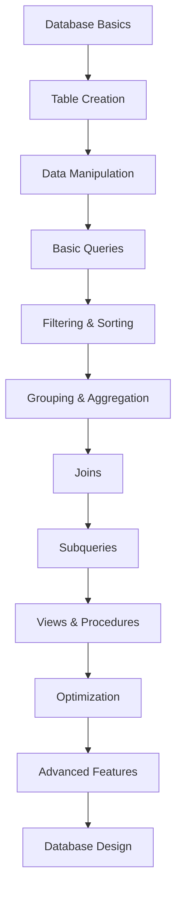

# Pembelajaran SQL Secara Bertahap

Selamat datang di materi pembelajaran SQL yang komprehensif! Materi ini dirancang untuk membantu Anda menguasai SQL dari dasar hingga tingkat lanjut dengan pendekatan bertahap dan studi kasus praktis menggunakan database relational.

## 🗄️ Apa itu SQL?

**SQL (Structured Query Language)** adalah bahasa pemrograman standar untuk mengelola dan memanipulasi database relational. SQL digunakan untuk membuat, mengubah, dan mengambil data dari database, serta mengelola struktur database itu sendiri.

## 📚 Struktur Pembelajaran

### 🎯 Level 1: SQL Fundamentals (7 lessons)
1. **[sql.1.md](./sql.1.md)** - Pengenalan SQL dan Database Basics
2. **[sql.2.md](./sql.2.md)** - CREATE TABLE dan Data Types
3. **[sql.3.md](./sql.3.md)** - INSERT, UPDATE, DELETE Operations
4. **[sql.4.md](./sql.4.md)** - SELECT Statements dan Basic Queries
5. **[sql.5.md](./sql.5.md)** - WHERE Clauses dan Filtering
6. **[sql.6.md](./sql.6.md)** - ORDER BY, GROUP BY, dan HAVING
7. **[sql.7.md](./sql.7.md)** - Aggregate Functions dan Calculations

### 🧩 Level 2: SQL Intermediate (7 lessons)
8. **[sql.8.md](./sql.8.md)** - JOINS - Inner, Left, Right, Full Outer
9. **[sql.9.md](./sql.9.md)** - Subqueries dan Nested Queries
10. **[sql.10.md](./sql.10.md)** - Views dan Virtual Tables
11. **[sql.11.md](./sql.11.md)** - Indexes dan Performance Optimization
12. **[sql.12.md](./sql.12.md)** - Constraints dan Data Integrity
13. **[sql.13.md](./sql.13.md)** - Stored Procedures dan Functions
14. **[sql.14.md](./sql.14.md)** - Triggers dan Event-Driven Programming

### 🚀 Level 3: SQL Advanced (6 lessons)
15. **[sql.15.md](./sql.15.md)** - Advanced Joins dan Complex Relationships
16. **[sql.16.md](./sql.16.md)** - Window Functions dan Analytics
17. **[sql.17.md](./sql.17.md)** - Common Table Expressions (CTEs)
18. **[sql.18.md](./sql.18.md)** - Database Design dan Normalization
19. **[sql.19.md](./sql.19.md)** - Transactions dan ACID Properties
20. **[sql.20.md](./sql.20.md)** - Advanced Optimization dan Best Practices

## 🎯 Tujuan Pembelajaran

Setelah menyelesaikan materi ini, Anda akan mampu:

### 🗄️ **SQL Core Skills**
- ✅ Membuat dan mengelola database structures
- ✅ Melakukan CRUD operations secara efisien
- ✅ Menulis complex queries dengan multiple joins
- ✅ Mengoptimalkan query performance dengan indexes
- ✅ Mengelola data integrity dengan constraints

### 🏗️ **Database Design & Architecture**
- ✅ Merancang normalized database schemas
- ✅ Mengimplementasikan relationships antar tables
- ✅ Membuat views dan stored procedures
- ✅ Mengelola transactions dan concurrency
- ✅ Mengoptimalkan database performance

### 💼 **Professional Database Skills**
- ✅ Database administration dan maintenance
- ✅ Data analysis dan reporting dengan SQL
- ✅ ETL processes dan data migration
- ✅ Security dan access control
- ✅ Backup, recovery, dan disaster planning

## 🚀 Mengapa Belajar SQL?

### SQL Advantages:
- **🌐 Universal Language** - Digunakan di semua database systems
- **💼 High Demand** - Essential skill untuk data-related jobs
- **🔍 Data Analysis** - Powerful tool untuk data exploration
- **⚡ Performance** - Efficient data retrieval dan manipulation
- **🏗️ Scalability** - Handle large datasets effectively
- **🔒 Security** - Robust security dan access control

### SQL Database Systems:

| Database | Type | Use Cases | Popularity |
|----------|------|-----------|------------|
| **MySQL** | Open Source | Web applications, e-commerce | Very High |
| **PostgreSQL** | Open Source | Enterprise, analytics, GIS | High |
| **SQL Server** | Commercial | Enterprise, Windows environments | High |
| **Oracle** | Commercial | Large enterprise, mission-critical | High |
| **SQLite** | Embedded | Mobile apps, small applications | High |
| **MariaDB** | Open Source | MySQL alternative, cloud | Growing |

## 📋 Prerequisites

### Basic Knowledge
- **Computer Literacy** - Basic computer operations
- **Logical Thinking** - Problem-solving approach
- **Mathematics** - Basic math dan statistics concepts
- **Data Concepts** - Understanding of data types dan structures

### Optional but Helpful
- **Programming Basics** - Any programming language
- **Spreadsheet Skills** - Excel, Google Sheets experience
- **Business Knowledge** - Understanding of business processes
- **Web Development** - For web application integration

## 🛠️ Development Environment Setup

### Database Installation Options

#### MySQL Setup
```bash
# Download MySQL Community Server
# https://dev.mysql.com/downloads/mysql/

# Install via Homebrew (macOS)
brew install mysql
brew services start mysql

# Install via apt (Ubuntu/Debian)
sudo apt update
sudo apt install mysql-server
sudo systemctl start mysql

# Connect to MySQL
mysql -u root -p
```

#### PostgreSQL Setup
```bash
# Install via Homebrew (macOS)
brew install postgresql
brew services start postgresql

# Install via apt (Ubuntu/Debian)
sudo apt update
sudo apt install postgresql postgresql-contrib
sudo systemctl start postgresql

# Connect to PostgreSQL
psql -U postgres
```

#### SQLite Setup (Lightweight)
```bash
# Install SQLite
# macOS (usually pre-installed)
sqlite3 --version

# Ubuntu/Debian
sudo apt install sqlite3

# Windows - download from https://sqlite.org/download.html

# Create database
sqlite3 mydatabase.db
```

### GUI Tools
```bash
# Popular Database Management Tools

# MySQL Workbench (MySQL)
# Download from: https://dev.mysql.com/downloads/workbench/

# pgAdmin (PostgreSQL)
# Download from: https://www.pgadmin.org/download/

# DBeaver (Universal)
# Download from: https://dbeaver.io/download/

# phpMyAdmin (Web-based MySQL)
# Install via package manager or XAMPP/WAMP

# TablePlus (macOS/Windows)
# Download from: https://tableplus.com/
```

### Online SQL Platforms
```
# Practice SQL Online (No Installation Required)

1. SQLiteOnline - https://sqliteonline.com/
2. W3Schools SQL Tryit - https://www.w3schools.com/sql/trysql.asp
3. SQLFiddle - http://sqlfiddle.com/
4. DB Fiddle - https://www.db-fiddle.com/
5. SQL Bolt - https://sqlbolt.com/
6. HackerRank SQL - https://www.hackerrank.com/domains/sql
```

## 🎯 Learning Path



## 🏆 Milestone Projects

Sepanjang pembelajaran, Anda akan membangun:

1. **Personal Library Database** - Basic CRUD operations
2. **E-commerce Database** - Complex relationships dan joins
3. **Employee Management System** - Views, procedures, dan triggers
4. **Sales Analytics Database** - Aggregate functions dan reporting
5. **Inventory Management System** - Transactions dan constraints
6. **Social Media Database** - Advanced relationships dan optimization
7. **Data Warehouse** - ETL processes dan analytics

## 📊 SQL Ecosystem

### Core SQL Commands
```sql
-- Data Definition Language (DDL)
CREATE TABLE users (
    id INT PRIMARY KEY AUTO_INCREMENT,
    name VARCHAR(100) NOT NULL,
    email VARCHAR(100) UNIQUE,
    created_at TIMESTAMP DEFAULT CURRENT_TIMESTAMP
);

-- Data Manipulation Language (DML)
INSERT INTO users (name, email) VALUES ('John Doe', 'john@example.com');
UPDATE users SET name = 'Jane Doe' WHERE id = 1;
DELETE FROM users WHERE id = 1;

-- Data Query Language (DQL)
SELECT u.name, COUNT(o.id) as order_count
FROM users u
LEFT JOIN orders o ON u.id = o.user_id
WHERE u.created_at >= '2024-01-01'
GROUP BY u.id, u.name
HAVING COUNT(o.id) > 5
ORDER BY order_count DESC;

-- Data Control Language (DCL)
GRANT SELECT, INSERT ON users TO 'app_user'@'localhost';
REVOKE DELETE ON users FROM 'app_user'@'localhost';
```

### Advanced SQL Features

| Feature | Purpose | Example Use Case |
|---------|---------|------------------|
| **Window Functions** | Analytics over partitions | Running totals, rankings |
| **CTEs** | Recursive queries | Hierarchical data, tree structures |
| **Stored Procedures** | Reusable business logic | Complex calculations |
| **Triggers** | Automatic actions | Audit trails, data validation |
| **Views** | Virtual tables | Security, simplified queries |
| **Indexes** | Query optimization | Fast data retrieval |

## 🎨 Database Design Patterns

### Normalization Example
```sql
-- 1NF: Atomic values
CREATE TABLE orders (
    id INT PRIMARY KEY,
    customer_name VARCHAR(100),
    product_name VARCHAR(100),
    quantity INT,
    price DECIMAL(10,2)
);

-- 2NF: Remove partial dependencies
CREATE TABLE customers (
    id INT PRIMARY KEY,
    name VARCHAR(100),
    email VARCHAR(100)
);

CREATE TABLE products (
    id INT PRIMARY KEY,
    name VARCHAR(100),
    price DECIMAL(10,2)
);

CREATE TABLE orders (
    id INT PRIMARY KEY,
    customer_id INT,
    product_id INT,
    quantity INT,
    FOREIGN KEY (customer_id) REFERENCES customers(id),
    FOREIGN KEY (product_id) REFERENCES products(id)
);

-- 3NF: Remove transitive dependencies
CREATE TABLE categories (
    id INT PRIMARY KEY,
    name VARCHAR(100)
);

ALTER TABLE products ADD COLUMN category_id INT;
ALTER TABLE products ADD FOREIGN KEY (category_id) REFERENCES categories(id);
```

### Common Relationships
```sql
-- One-to-Many: User has many Orders
CREATE TABLE users (
    id INT PRIMARY KEY,
    name VARCHAR(100)
);

CREATE TABLE orders (
    id INT PRIMARY KEY,
    user_id INT,
    total DECIMAL(10,2),
    FOREIGN KEY (user_id) REFERENCES users(id)
);

-- Many-to-Many: Products and Categories
CREATE TABLE products (
    id INT PRIMARY KEY,
    name VARCHAR(100)
);

CREATE TABLE categories (
    id INT PRIMARY KEY,
    name VARCHAR(100)
);

CREATE TABLE product_categories (
    product_id INT,
    category_id INT,
    PRIMARY KEY (product_id, category_id),
    FOREIGN KEY (product_id) REFERENCES products(id),
    FOREIGN KEY (category_id) REFERENCES categories(id)
);

-- One-to-One: User Profile
CREATE TABLE user_profiles (
    user_id INT PRIMARY KEY,
    bio TEXT,
    avatar_url VARCHAR(255),
    FOREIGN KEY (user_id) REFERENCES users(id)
);
```

## 🎓 Career Paths dalam SQL

### Technical Roles
- **Database Administrator (DBA)** - Database management dan optimization
- **Data Analyst** - Data analysis dan reporting
- **Data Engineer** - ETL processes dan data pipelines
- **Backend Developer** - Application database integration
- **Business Intelligence Developer** - BI solutions dan dashboards

### Specialized Roles
- **Database Architect** - Database design dan strategy
- **Data Scientist** - Advanced analytics dan machine learning
- **ETL Developer** - Data integration specialist
- **Performance Tuning Specialist** - Database optimization expert
- **Database Security Specialist** - Security dan compliance

### Industry Applications
- **E-commerce** - Product catalogs, order management
- **Finance** - Transaction processing, fraud detection
- **Healthcare** - Patient records, medical analytics
- **Education** - Student information systems
- **Government** - Public records, data management
- **Technology** - User data, application analytics

## 🌟 Success Metrics

### Technical Skills
- [ ] **Query Proficiency** - Write efficient, complex queries
- [ ] **Database Design** - Create normalized, scalable schemas
- [ ] **Performance Optimization** - Optimize slow queries dan indexes
- [ ] **Data Integrity** - Implement proper constraints dan validation
- [ ] **Security** - Manage access control dan data protection
- [ ] **Troubleshooting** - Debug dan resolve database issues

### Project Milestones
- [ ] Design and implement first database schema
- [ ] Write complex multi-table queries with joins
- [ ] Create stored procedures dan triggers
- [ ] Optimize database performance with indexes
- [ ] Implement data backup dan recovery procedures
- [ ] Build data analytics dan reporting system

## 🤝 Community dan Resources

### Learning Resources
- [W3Schools SQL Tutorial](https://www.w3schools.com/sql/)
- [SQLBolt Interactive Lessons](https://sqlbolt.com/)
- [MySQL Documentation](https://dev.mysql.com/doc/)
- [PostgreSQL Documentation](https://www.postgresql.org/docs/)

### Communities
- [Stack Overflow SQL](https://stackoverflow.com/questions/tagged/sql)
- [Reddit r/SQL](https://www.reddit.com/r/SQL/)
- [DBA Stack Exchange](https://dba.stackexchange.com/)
- [SQL Server Central](https://www.sqlservercentral.com/)

### Practice Platforms
- **HackerRank SQL** - Coding challenges
- **LeetCode Database** - Interview preparation
- **SQLZoo** - Interactive tutorials
- **Kaggle Learn SQL** - Data science focused
- **Mode Analytics SQL Tutorial** - Business analytics

## 💡 Best Practices

### Query Optimization
- **Use Indexes** - Create indexes on frequently queried columns
- **Limit Results** - Use LIMIT/TOP untuk large datasets
- **Avoid SELECT *** - Select only needed columns
- **Use Joins Efficiently** - Prefer INNER JOINs when possible
- **Analyze Execution Plans** - Understand query performance

### Database Design
1. **Normalize Appropriately** - Balance normalization dengan performance
2. **Use Appropriate Data Types** - Choose efficient data types
3. **Implement Constraints** - Ensure data integrity
4. **Plan for Scalability** - Design for future growth
5. **Document Schema** - Maintain clear documentation

### Security Guidelines
1. **Use Parameterized Queries** - Prevent SQL injection
2. **Principle of Least Privilege** - Grant minimal necessary permissions
3. **Regular Backups** - Implement backup strategies
4. **Monitor Access** - Track database usage dan access
5. **Encrypt Sensitive Data** - Protect sensitive information

## 📈 Salary Expectations

### Entry Level (0-2 years)
- **Junior Database Developer** - $45k-65k
- **Data Analyst** - $50k-70k
- **Junior DBA** - $55k-75k

### Mid Level (2-5 years)
- **Database Developer** - $65k-90k
- **Senior Data Analyst** - $70k-95k
- **Database Administrator** - $75k-100k

### Senior Level (5+ years)
- **Senior DBA** - $90k-130k
- **Database Architect** - $100k-150k
- **Principal Data Engineer** - $120k-180k

### Freelance/Contract
- **SQL Developer** - $30-75/hour
- **Database Consultant** - $50-125/hour
- **Data Analytics Specialist** - $40-100/hour

## 🔧 Modern SQL Features

### Advanced Analytics
```sql
-- Window Functions
SELECT 
    name,
    salary,
    AVG(salary) OVER (PARTITION BY department) as dept_avg,
    ROW_NUMBER() OVER (ORDER BY salary DESC) as salary_rank
FROM employees;

-- Common Table Expressions
WITH recursive_cte AS (
    SELECT id, name, manager_id, 1 as level
    FROM employees 
    WHERE manager_id IS NULL
    
    UNION ALL
    
    SELECT e.id, e.name, e.manager_id, r.level + 1
    FROM employees e
    JOIN recursive_cte r ON e.manager_id = r.id
)
SELECT * FROM recursive_cte;

-- JSON Support (Modern databases)
SELECT 
    name,
    JSON_EXTRACT(metadata, '$.age') as age,
    JSON_EXTRACT(metadata, '$.skills') as skills
FROM users 
WHERE JSON_EXTRACT(metadata, '$.active') = true;
```

---

**Selamat belajar! 🗄️**

*"SQL is the lingua franca of data. Master it, and you unlock the power to work with data across any platform, any database, any scale."*

**Ready to become a database expert? Let's start querying! 🚀**
