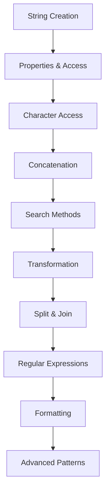

# Pembelajaran JavaScript Strings Secara Bertahap

Selamat datang di materi pembelajaran JavaScript Strings yang komprehensif! Materi ini dirancang untuk membantu Anda menguasai string manipulation dalam JavaScript dari dasar hingga tingkat lanjut dengan pendekatan bertahap dan studi kasus praktis.

## 📝 Apa itu JavaScript Strings?

**JavaScript Strings** adalah primitive data type yang digunakan untuk menyimpan dan memanipulasi text. Strings adalah immutable sequences of characters yang menyediakan banyak built-in methods untuk text processing, formatting, dan manipulation yang powerful dan efficient.

## 📚 Struktur Pembelajaran

### 🎯 Level 1: String Fundamentals (4 lessons)
1. **[string.1.md](./string.1.md)** - Pengenalan Strings dan String Creation
2. **[string.2.md](./string.2.md)** - String Properties dan Basic Operations
3. **[string.3.md](./string.3.md)** - String Indexing dan Character Access
4. **[string.4.md](./string.4.md)** - String Concatenation dan Template Literals

### 🧩 Level 2: String Methods (3 lessons)
5. **[string.5.md](./string.5.md)** - String Search dan Find Methods
6. **[string.6.md](./string.6.md)** - String Transformation Methods
7. **[string.7.md](./string.7.md)** - String Splitting dan Joining

### 🚀 Level 3: Advanced Strings (3 lessons)
8. **[string.8.md](./string.8.md)** - Regular Expressions dengan Strings
9. **[string.9.md](./string.9.md)** - String Formatting dan Internationalization
10. **[string.10.md](./string.10.md)** - Advanced String Patterns dan Performance

## 🎯 Tujuan Pembelajaran

Setelah menyelesaikan materi ini, Anda akan mampu:

### 📝 **String Core Skills**
- ✅ Membuat dan memanipulasi strings dengan berbagai methods
- ✅ Menggunakan template literals untuk dynamic string creation
- ✅ Menerapkan regular expressions untuk pattern matching
- ✅ Mengelola string formatting dan internationalization
- ✅ Mengoptimalkan performance string operations

### 🔍 **Text Processing**
- ✅ Search dan replace operations
- ✅ String validation dan sanitization
- ✅ Text parsing dan extraction
- ✅ Data formatting dan presentation
- ✅ Internationalization dan localization

### 💼 **Real-world Applications**
- ✅ Form validation dan user input processing
- ✅ Data parsing dari APIs dan files
- ✅ URL manipulation dan routing
- ✅ Template rendering dan content generation
- ✅ Text analysis dan processing

## 🚀 Mengapa Belajar JavaScript Strings?

### JavaScript Strings Advantages:
- **📝 Text Processing** - Essential untuk all text manipulation
- **🔍 Rich Methods** - Extensive built-in methods untuk manipulation
- **🌐 Unicode Support** - Full Unicode dan emoji support
- **⚡ Performance** - Optimized untuk common text operations
- **🎯 Immutability** - Safe dari accidental mutations
- **🔧 Flexibility** - Support untuk multiple string formats

### Strings vs Other Text Types:

| Type | Mutability | Performance | Use Case |
|------|------------|-------------|----------|
| **Strings** | Immutable | Good | General text |
| **Arrays of Chars** | Mutable | Variable | Character manipulation |
| **StringBuilder** | Mutable | High | Large text building |
| **Template Literals** | Immutable | Good | Dynamic content |

## 📋 Prerequisites

### JavaScript Knowledge
- **JavaScript Basics** - Variables, functions, data types
- **Control Structures** - Loops, conditionals
- **Arrays** - Basic array operations
- **Objects** - Basic object manipulation
- **ES6+ Features** - Template literals, destructuring

### Development Environment
- **Code Editor** - VS Code dengan JavaScript extensions
- **Web Browser** - Chrome/Firefox dengan DevTools
- **Node.js** - JavaScript runtime (optional)
- **Package Manager** - npm atau yarn (optional)

### Optional but Helpful
- **Regular Expressions** - Pattern matching basics
- **Unicode** - Character encoding understanding
- **Internationalization** - Multi-language support concepts
- **Performance** - String optimization techniques
- **Testing** - Unit testing concepts

## 🛠️ Development Environment Setup

### Basic Setup
```bash
# Create project directory
mkdir javascript-strings-learning
cd javascript-strings-learning

# Create basic files
touch index.js
touch index.html
touch strings-examples.js

# Optional: Initialize npm project
npm init -y
```

### HTML Template
```html
<!DOCTYPE html>
<html lang="en">
<head>
    <meta charset="UTF-8">
    <meta name="viewport" content="width=device-width, initial-scale=1.0">
    <title>JavaScript Strings Learning</title>
</head>
<body>
    <h1>JavaScript Strings Examples</h1>
    
    <div id="output"></div>
    <input type="text" id="textInput" placeholder="Enter text to process">
    <button id="processText">Process Text</button>
    
    <script src="strings-examples.js"></script>
    <script src="index.js"></script>
</body>
</html>
```

### VS Code Configuration
```json
// .vscode/settings.json
{
  "javascript.preferences.quoteStyle": "single",
  "javascript.format.semicolons": "insert",
  "javascript.inlayHints.parameterNames.enabled": "all",
  "javascript.inlayHints.variableTypes.enabled": true,
  "editor.codeActionsOnSave": {
    "source.fixAll.eslint": true
  }
}
```

## 🎯 Learning Path



## 🏆 Milestone Projects

Sepanjang pembelajaran, Anda akan membangun:

1. **Text Formatter** - Basic string manipulation dan formatting
2. **Email Validator** - Regular expressions untuk validation
3. **URL Parser** - String parsing dan extraction
4. **Template Engine** - Dynamic content generation
5. **Text Analyzer** - Word count, sentiment analysis
6. **Internationalization System** - Multi-language support
7. **Code Generator** - Template-based code generation

## 📝 JavaScript Strings Core Concepts

### String Creation dan Literals
```javascript
// String literal with single quotes
const singleQuoted = 'Hello, World!';

// String literal with double quotes
const doubleQuoted = "Hello, World!";

// String literal with backticks (template literals)
const templateLiteral = `Hello, World!`;

// String constructor (rarely used)
const stringObject = new String('Hello, World!');

// Multi-line strings
const multiLine = `This is a
multi-line
string`;

// Escape sequences
const escaped = 'It\'s a "beautiful" day\nNew line here\tTab here';
const unicode = '\u0048\u0065\u006C\u006C\u006F'; // "Hello"
const hex = '\x48\x65\x6C\x6C\x6F'; // "Hello"

// Raw strings (template literals)
const rawString = String.raw`C:\Users\Name\Documents`;

console.log('Single quoted:', singleQuoted);
console.log('Multi-line:', multiLine);
console.log('Escaped:', escaped);
console.log('Unicode:', unicode);
console.log('Raw string:', rawString);

// String length
console.log('Length:', singleQuoted.length);

// Empty string check
const emptyString = '';
console.log('Is empty:', emptyString.length === 0);
console.log('Is empty (alternative):', emptyString === '');
```

### Template Literals dan Interpolation
```javascript
const name = 'John';
const age = 30;
const city = 'New York';

// Basic interpolation
const greeting = `Hello, my name is ${name} and I'm ${age} years old.`;

// Expression interpolation
const calculation = `The result is: ${10 + 20}`;
const conditional = `You are ${age >= 18 ? 'an adult' : 'a minor'}`;

// Function calls in templates
function formatCurrency(amount) {
    return `$${amount.toFixed(2)}`;
}

const price = 29.99;
const priceMessage = `The price is ${formatCurrency(price)}`;

// Multi-line template with indentation
const htmlTemplate = `
    <div class="user-card">
        <h2>${name}</h2>
        <p>Age: ${age}</p>
        <p>City: ${city}</p>
    </div>
`;

// Nested templates
const userList = ['Alice', 'Bob', 'Charlie'];
const listHTML = `
    <ul>
        ${userList.map(user => `<li>${user}</li>`).join('')}
    </ul>
`;

// Tagged template literals
function highlight(strings, ...values) {
    return strings.reduce((result, string, i) => {
        const value = values[i] ? `<mark>${values[i]}</mark>` : '';
        return result + string + value;
    }, '');
}

const highlighted = highlight`Hello ${name}, you are ${age} years old!`;

console.log('Greeting:', greeting);
console.log('Calculation:', calculation);
console.log('Price message:', priceMessage);
console.log('HTML template:', htmlTemplate);
console.log('Highlighted:', highlighted);
```

### String Methods dan Manipulation
```javascript
const text = '  JavaScript is Amazing!  ';

// Case conversion
console.log('Uppercase:', text.toUpperCase());
console.log('Lowercase:', text.toLowerCase());
console.log('Locale uppercase:', text.toLocaleUpperCase('tr-TR')); // Turkish

// Trimming whitespace
console.log('Trimmed:', text.trim());
console.log('Trim start:', text.trimStart());
console.log('Trim end:', text.trimEnd());

// Padding
const number = '42';
console.log('Pad start:', number.padStart(5, '0')); // "00042"
console.log('Pad end:', number.padEnd(5, '0')); // "42000"

// Repeating
const pattern = '=';
console.log('Repeated:', pattern.repeat(10)); // "=========="

// Substring extraction
const sentence = 'The quick brown fox jumps over the lazy dog';

console.log('Substring:', sentence.substring(4, 9)); // "quick"
console.log('Slice:', sentence.slice(4, 9)); // "quick"
console.log('Slice negative:', sentence.slice(-8, -4)); // "lazy"

// Character access
console.log('Character at 0:', sentence.charAt(0)); // "T"
console.log('Character at 0 (bracket):', sentence[0]); // "T"
console.log('Character code:', sentence.charCodeAt(0)); // 84

// String search
console.log('Index of "fox":', sentence.indexOf('fox')); // 16
console.log('Last index of "o":', sentence.lastIndexOf('o')); // 41
console.log('Includes "fox":', sentence.includes('fox')); // true
console.log('Starts with "The":', sentence.startsWith('The')); // true
console.log('Ends with "dog":', sentence.endsWith('dog')); // true

// String replacement
console.log('Replace first:', sentence.replace('o', '0')); // Replace first 'o'
console.log('Replace all:', sentence.replaceAll('o', '0')); // Replace all 'o'

// Split and join
const words = sentence.split(' ');
console.log('Words:', words);
console.log('Rejoined:', words.join(' '));

// Split with limit
const limitedWords = sentence.split(' ', 3);
console.log('Limited words:', limitedWords);
```

### Regular Expressions dengan Strings
```javascript
const emailText = 'Contact us at: john@example.com or support@company.org';
const phoneText = 'Call us at: (555) 123-4567 or 555-987-6543';

// Email regex
const emailRegex = /\b[A-Za-z0-9._%+-]+@[A-Za-z0-9.-]+\.[A-Z|a-z]{2,}\b/g;
const emails = emailText.match(emailRegex);
console.log('Found emails:', emails);

// Phone regex
const phoneRegex = /(\(?\d{3}\)?[-.\s]?\d{3}[-.\s]?\d{4})/g;
const phones = phoneText.match(phoneRegex);
console.log('Found phones:', phones);

// Replace with regex
const cleanedPhone = phoneText.replace(phoneRegex, '[PHONE]');
console.log('Cleaned phone text:', cleanedPhone);

// Search with regex
const searchResult = emailText.search(emailRegex);
console.log('First email position:', searchResult);

// Test with regex
const isValidEmail = (email) => {
    const regex = /^[A-Za-z0-9._%+-]+@[A-Za-z0-9.-]+\.[A-Z|a-z]{2,}$/;
    return regex.test(email);
};

console.log('Valid email test:', isValidEmail('test@example.com'));
console.log('Invalid email test:', isValidEmail('invalid-email'));

// Advanced regex with groups
const urlRegex = /https?:\/\/(www\.)?([a-zA-Z0-9-]+)\.([a-zA-Z]{2,})(\/[^\s]*)?/g;
const urlText = 'Visit https://www.example.com/page or http://test.org';

let match;
while ((match = urlRegex.exec(urlText)) !== null) {
    console.log('Full URL:', match[0]);
    console.log('Subdomain:', match[1]);
    console.log('Domain:', match[2]);
    console.log('TLD:', match[3]);
    console.log('Path:', match[4]);
}

// String validation functions
const validators = {
    email: (str) => /^[A-Za-z0-9._%+-]+@[A-Za-z0-9.-]+\.[A-Z|a-z]{2,}$/.test(str),
    phone: (str) => /^\(?\d{3}\)?[-.\s]?\d{3}[-.\s]?\d{4}$/.test(str),
    url: (str) => /^https?:\/\/[^\s]+$/.test(str),
    creditCard: (str) => /^\d{4}[-\s]?\d{4}[-\s]?\d{4}[-\s]?\d{4}$/.test(str),
    zipCode: (str) => /^\d{5}(-\d{4})?$/.test(str)
};

console.log('Email validation:', validators.email('test@example.com'));
console.log('Phone validation:', validators.phone('(555) 123-4567'));
```

### Advanced String Processing
```javascript
// String formatting utilities
class StringFormatter {
    static toCamelCase(str) {
        return str.replace(/[-_\s]+(.)?/g, (_, char) => 
            char ? char.toUpperCase() : ''
        );
    }
    
    static toPascalCase(str) {
        const camelCase = StringFormatter.toCamelCase(str);
        return camelCase.charAt(0).toUpperCase() + camelCase.slice(1);
    }
    
    static toKebabCase(str) {
        return str.replace(/([a-z])([A-Z])/g, '$1-$2')
                  .replace(/[\s_]+/g, '-')
                  .toLowerCase();
    }
    
    static toSnakeCase(str) {
        return str.replace(/([a-z])([A-Z])/g, '$1_$2')
                  .replace(/[\s-]+/g, '_')
                  .toLowerCase();
    }
    
    static capitalize(str) {
        return str.charAt(0).toUpperCase() + str.slice(1).toLowerCase();
    }
    
    static titleCase(str) {
        return str.split(' ')
                  .map(word => StringFormatter.capitalize(word))
                  .join(' ');
    }
    
    static truncate(str, length, suffix = '...') {
        if (str.length <= length) return str;
        return str.substring(0, length - suffix.length) + suffix;
    }
    
    static slugify(str) {
        return str.toLowerCase()
                  .replace(/[^\w\s-]/g, '')
                  .replace(/[\s_-]+/g, '-')
                  .replace(/^-+|-+$/g, '');
    }
}

// Usage examples
const testString = 'hello world example';
console.log('Camel case:', StringFormatter.toCamelCase(testString));
console.log('Pascal case:', StringFormatter.toPascalCase(testString));
console.log('Kebab case:', StringFormatter.toKebabCase('HelloWorldExample'));
console.log('Snake case:', StringFormatter.toSnakeCase('HelloWorldExample'));
console.log('Title case:', StringFormatter.titleCase(testString));
console.log('Slugify:', StringFormatter.slugify('Hello World! This is a Test.'));

// Text analysis utilities
class TextAnalyzer {
    static wordCount(text) {
        return text.trim().split(/\s+/).filter(word => word.length > 0).length;
    }
    
    static characterCount(text, includeSpaces = true) {
        return includeSpaces ? text.length : text.replace(/\s/g, '').length;
    }
    
    static sentenceCount(text) {
        return text.split(/[.!?]+/).filter(sentence => 
            sentence.trim().length > 0
        ).length;
    }
    
    static averageWordsPerSentence(text) {
        const words = TextAnalyzer.wordCount(text);
        const sentences = TextAnalyzer.sentenceCount(text);
        return sentences > 0 ? (words / sentences).toFixed(2) : 0;
    }
    
    static mostFrequentWords(text, count = 5) {
        const words = text.toLowerCase()
                         .replace(/[^\w\s]/g, '')
                         .split(/\s+/)
                         .filter(word => word.length > 2);
        
        const frequency = {};
        words.forEach(word => {
            frequency[word] = (frequency[word] || 0) + 1;
        });
        
        return Object.entries(frequency)
                    .sort(([,a], [,b]) => b - a)
                    .slice(0, count)
                    .map(([word, freq]) => ({ word, frequency: freq }));
    }
    
    static readingTime(text, wordsPerMinute = 200) {
        const words = TextAnalyzer.wordCount(text);
        const minutes = Math.ceil(words / wordsPerMinute);
        return `${minutes} min read`;
    }
}

// Template engine
class SimpleTemplateEngine {
    static render(template, data) {
        return template.replace(/\{\{(\w+)\}\}/g, (match, key) => {
            return data.hasOwnProperty(key) ? data[key] : match;
        });
    }
    
    static renderAdvanced(template, data) {
        return template.replace(/\{\{([\w.]+)\}\}/g, (match, path) => {
            const value = path.split('.').reduce((obj, key) => 
                obj && obj[key] !== undefined ? obj[key] : undefined, data
            );
            return value !== undefined ? value : match;
        });
    }
    
    static renderWithHelpers(template, data, helpers = {}) {
        // Replace helper functions
        let result = template.replace(/\{\{(\w+)\s+(.+?)\}\}/g, (match, helper, args) => {
            if (helpers[helper]) {
                const argValues = args.split(/\s+/).map(arg => {
                    // Simple argument parsing
                    if (arg.startsWith('"') && arg.endsWith('"')) {
                        return arg.slice(1, -1);
                    }
                    return data[arg] || arg;
                });
                return helpers[helper](...argValues);
            }
            return match;
        });
        
        // Replace simple variables
        result = result.replace(/\{\{(\w+)\}\}/g, (match, key) => {
            return data.hasOwnProperty(key) ? data[key] : match;
        });
        
        return result;
    }
}

// Usage examples
const sampleText = `
    JavaScript is a versatile programming language. It's used for web development, 
    server-side programming, and mobile app development. JavaScript has evolved 
    significantly over the years. Modern JavaScript includes many powerful features.
`;

console.log('Word count:', TextAnalyzer.wordCount(sampleText));
console.log('Character count:', TextAnalyzer.characterCount(sampleText));
console.log('Reading time:', TextAnalyzer.readingTime(sampleText));
console.log('Most frequent words:', TextAnalyzer.mostFrequentWords(sampleText));

// Template rendering
const template = 'Hello {{name}}, you have {{count}} messages.';
const templateData = { name: 'John', count: 5 };
console.log('Rendered template:', SimpleTemplateEngine.render(template, templateData));
```

## 🎓 Career Paths dalam JavaScript Strings

### Technical Roles
- **Frontend Developer** - String manipulation untuk UI components
- **Backend Developer** - Data parsing dan text processing
- **Full-Stack Developer** - End-to-end text handling
- **Data Engineer** - Text data processing dan ETL
- **Content Developer** - Template systems dan content management

### Specialized Roles
- **Text Processing Specialist** - Advanced text analysis dan NLP
- **Template Engine Developer** - Dynamic content generation systems
- **Localization Engineer** - Internationalization dan multi-language support
- **Data Parser Developer** - File format parsing dan conversion
- **Search Engineer** - Text search dan indexing systems

### Industry Applications
- **Web Development** - Form validation, content management
- **E-commerce** - Product descriptions, search functionality
- **Content Management** - CMS systems, blog platforms
- **Data Analytics** - Text mining, sentiment analysis
- **Communication** - Chat systems, email processing
- **Documentation** - Technical writing, API documentation

## 🌟 Success Metrics

### Technical Skills
- [ ] **String Creation** - Multiple creation patterns dan literals
- [ ] **Method Mastery** - All string methods dan use cases
- [ ] **Regular Expressions** - Pattern matching dan validation
- [ ] **Template Systems** - Dynamic content generation
- [ ] **Performance** - Efficient string operations
- [ ] **Internationalization** - Multi-language text handling

### Project Milestones
- [ ] Build text processing utility library
- [ ] Implement form validation system
- [ ] Create template engine
- [ ] Build text analysis tool
- [ ] Implement search functionality
- [ ] Create internationalization system

## 🤝 Community dan Resources

### Learning Resources
- [MDN JavaScript Strings](https://developer.mozilla.org/en-US/docs/Web/JavaScript/Reference/Global_Objects/String)
- [JavaScript.info Strings](https://javascript.info/string)
- [Regular Expressions Guide](https://regexr.com/)
- [Unicode in JavaScript](https://mathiasbynens.be/notes/javascript-unicode)

### Communities
- [Stack Overflow JavaScript](https://stackoverflow.com/questions/tagged/javascript)
- [Reddit r/javascript](https://www.reddit.com/r/javascript/)
- [JavaScript Discord](https://discord.gg/javascript)
- [Dev.to JavaScript](https://dev.to/t/javascript)

### Tools dan Services
- **Development**: Chrome DevTools, Node.js
- **Testing**: Jest, Mocha, Jasmine
- **Regex Tools**: RegExr, Regex101, RegexPal
- **Text Processing**: Natural, compromise.js
- **Internationalization**: i18next, FormatJS

## 💡 Best Practices

### String Performance
- **Avoid concatenation loops** - Use array join atau template literals
- **Use appropriate methods** - Choose right method untuk task
- **Consider immutability** - Strings are immutable dalam JavaScript
- **Cache regex patterns** - Compile regex once, use multiple times
- **Use StringBuilder pattern** - For large string building operations

### Code Organization
1. **Pure Functions** - Avoid side effects dalam string operations
2. **Input Validation** - Always validate string inputs
3. **Error Handling** - Handle null, undefined, dan edge cases
4. **Consistent Formatting** - Use consistent string formatting patterns
5. **Documentation** - Document complex string operations

### Security Considerations
1. **Input Sanitization** - Clean user input to prevent XSS
2. **SQL Injection** - Use parameterized queries, not string concatenation
3. **Path Traversal** - Validate file paths dan URLs
4. **Regular Expression DoS** - Avoid catastrophic backtracking
5. **Unicode Normalization** - Handle Unicode properly

## 📈 Salary Expectations

### Entry Level (0-2 years)
- **Junior JavaScript Developer** - $45k-65k
- **Frontend Developer** - $50k-70k
- **Web Developer** - $40k-60k

### Mid Level (2-5 years)
- **JavaScript Developer** - $65k-90k
- **Senior Frontend Developer** - $75k-105k
- **Full-Stack Developer** - $70k-100k

### Senior Level (5+ years)
- **Senior JavaScript Engineer** - $95k-125k
- **Text Processing Specialist** - $90k-120k
- **Technical Lead** - $100k-130k

### Specialized Roles
- **NLP Engineer** - $110k-150k
- **Search Engineer** - $105k-140k
- **JavaScript Consultant** - $75-150/hour

---

**Selamat belajar! 📝**

*"Strings are the foundation of all text processing in JavaScript. Master them, and you'll have the power to manipulate, validate, and transform text in countless ways."*

**Ready to master JavaScript strings? Let's start coding! 🚀**
